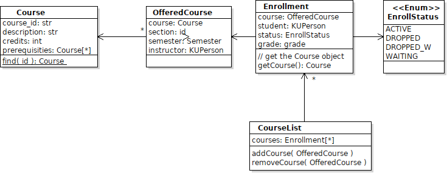

This diagram describes code for recording enrollment
in courses at KU.

It uses the *Abstraction-Occurrence* Design Pattern.
A `Course` is the abstaction (a course is something
in the university catalog). 

An `OfferedCourse` is the occurence.  There may be
many offered courses for the same `Course` object,
each with a different section or different semester.

Write as much code as you can based on the diagram.

